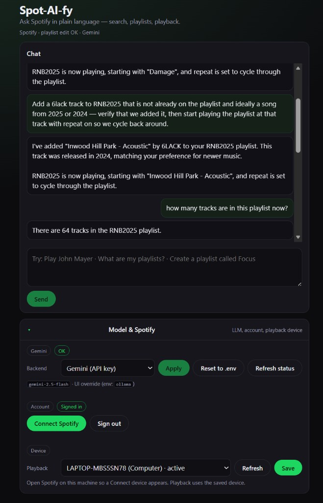

# Spot-AI-fy

**Ask Spotify in plain language — search, playlists, playback.**

Spot-AI-fy is a local-first natural-language front end for the Spotify Web API. You type things like *"add a SZA song from 2024 to RNB2025 and play the playlist starting at that track with repeat on"* and an LLM translates that into a sequence of Spotify API calls — search, dedupe against the playlist, add, verify, play, set repeat — returning one short summary.



---

## What it is

- **A Python backend** (FastAPI) that handles Spotify PKCE OAuth, wraps the Spotify Web API as a set of strongly-typed tools, and routes chat turns through either [Ollama](https://ollama.com/) (local) or [Google Gemini](https://ai.google.dev/) (cloud).
- **A React/Vite frontend** — minimal UI with a chat panel, LLM provider switcher, Spotify sign-in, and device picker.
- **An MCP server** (`run_mcp.py`) exposing the same Spotify tools over the [Model Context Protocol](https://modelcontextprotocol.io) so any MCP-aware client (Claude Desktop, Cursor, etc.) can drive your Spotify account directly.
- **Tokens live on your machine only** — refresh tokens go to `%USERPROFILE%\.spot_ai_fy\tokens.json` (outside the repo). Nothing runs in the cloud except the LLM call itself (and only if you choose Gemini; with Ollama the whole stack is local).

## Features

- **Natural-language Spotify control** across search, library, playlists, and playback.
- **Composite tools** that do multi-step workflows in one LLM call:
  - `spotify_add_tracks_by_query` — search + year filter + dedupe against the target playlist + add, all guaranteeing real Spotify track IDs (no fabricated / ghost rows).
  - `spotify_play_playlist` — start a playlist at a specific track **and** apply repeat/shuffle in one call, with post-call verification that the device actually switched.
- **Play-now vs. play-next clarity** — explicit separate tools (`spotify_start_resume_playback` / `spotify_play_playlist` for immediate interruption, `spotify_add_to_queue` / `spotify_play_next` for queueing).
- **Resilient playback** — verifies Spotify actually switched to the requested track; force-skips past queue reorderings when needed; recovers from Spotify's transient `502` edge errors by polling `/me/player`.
- **Good OAuth diagnostics** — distinguishes stale scopes (requires re-consent, since Spotify refresh tokens don't upgrade scopes), not-owned playlists, and the Spotify Web API [Feb 2026 dev-mode migration](https://developer.spotify.com/blog/2026-02-06-update-on-developer-access-and-platform-security) (`/tracks` → `/items`, removed `/artists/{id}/top-tracks`, capped `/search` limit).
- **Two LLM backends, swappable at runtime from the UI** — no `.env` edit needed to switch between local Ollama and Gemini.
- **Optional agent-context file** — drop a markdown file in `backend/AGENT_CONTEXT.md` (or point `AGENT_CONTEXT_FILE` at a path) and it's appended to the system prompt for both backends, letting you tune tone and rules without editing Python.

## Architecture

```
┌─────────────────┐      HTTP / SSE       ┌──────────────────────────┐      HTTPS       ┌─────────────────┐
│ React + Vite UI │ ───────────────────▶  │ FastAPI backend          │ ───────────────▶ │ Spotify Web API │
│  localhost:5173 │                       │  /login /callback        │                  └─────────────────┘
└─────────────────┘                       │  /chat /chat/stream      │
                                          │  /me /devices /playback  │                  ┌─────────────────┐
                                          │  /llm/provider           │  Ollama HTTP ──▶ │ Ollama (local)  │
                                          │  SpotifyToolRunner       │  or Gemini API   │ or Gemini cloud │
                                          └────────────┬─────────────┘                  └─────────────────┘
                                                       │
                                                       │ stdio
                                                       ▼
                                          ┌──────────────────────────┐
                                          │ MCP server (optional)    │
                                          │  run_mcp.py              │
                                          └──────────────────────────┘
```

Refresh tokens, device choice, and LLM preferences persist in `%USERPROFILE%\.spot_ai_fy\` (Windows) or `~/.spot_ai_fy/` (macOS/Linux) — **never** inside the repo.

## Quickstart

### Prerequisites

- Python 3.12+ and Node 20+.
- A Spotify Developer app — create one at [developer.spotify.com/dashboard](https://developer.spotify.com/dashboard). Add `http://127.0.0.1:8765/callback` as a Redirect URI. Copy the **Client ID** (you do **not** need a client secret for the default PKCE flow).
- Either [Ollama](https://ollama.com/download) running locally **or** a [Google AI Studio API key](https://aistudio.google.com/apikey) for Gemini.

### 1. Backend

```powershell
cd backend
python -m venv .venv
.\.venv\Scripts\Activate.ps1
pip install -r requirements.txt

Copy-Item .env.example .env
notepad .env   # paste your SPOTIFY_CLIENT_ID (and GEMINI_API_KEY if using Gemini)

uvicorn spot_backend.app:app --host 127.0.0.1 --port 8765 --reload
```

macOS/Linux equivalent:

```bash
cd backend
python3 -m venv .venv
source .venv/bin/activate
pip install -r requirements.txt

cp .env.example .env
${EDITOR:-nano} .env

uvicorn spot_backend.app:app --host 127.0.0.1 --port 8765 --reload
```

### 2. Frontend

```powershell
cd frontend
npm install
npm run dev
```

Open [http://localhost:5173](http://localhost:5173), click **Connect Spotify**, pick a playback device, and start chatting.

### 3. (Optional) MCP server

```powershell
cd backend
.\.venv\Scripts\Activate.ps1
python run_mcp.py
```

Point any MCP client at this stdio server to use the same Spotify tools from inside Claude Desktop, Cursor, etc.

## Environment variables

All variables live in `backend/.env` (see [`backend/.env.example`](backend/.env.example) for the annotated template). Only `SPOTIFY_CLIENT_ID` is strictly required.

| Variable | Purpose |
| --- | --- |
| `SPOTIFY_CLIENT_ID` | Required. Public client id from the Spotify developer dashboard (safe to keep in `.env`). |
| `SPOTIFY_CLIENT_SECRET` | Optional — only used if you want classic confidential OAuth instead of PKCE. Leave empty otherwise. |
| `SPOTIFY_REDIRECT_URI` | Defaults to `http://127.0.0.1:8765/callback`. Must match the one registered on the Spotify dashboard. |
| `API_HOST` / `API_PORT` | Where the FastAPI backend binds (defaults `127.0.0.1:8765`). |
| `FRONTEND_ORIGIN` | CORS origin for the Vite dev server (default `http://localhost:5173`). |
| `LLM_PROVIDER` | `ollama` (default, local) or `gemini` (cloud). Runtime overridable from the UI. |
| `OLLAMA_HOST` / `OLLAMA_MODEL` | Ollama endpoint and default model tag (e.g. `gemma2:2b`). Model tag is overridable from the UI. |
| `GEMINI_API_KEY` / `GEMINI_MODEL` | Required only when using Gemini. Get a key at [aistudio.google.com/apikey](https://aistudio.google.com/apikey). Default model `gemini-2.5-flash`. |
| `AGENT_CONTEXT_FILE` | Optional path to a markdown file appended to the system prompt for both LLMs. |
| `DATA_DIR` | Optional override for where tokens / device / LLM prefs are stored (defaults to `%USERPROFILE%\.spot_ai_fy`). |
| `SPOTIFY_SHOW_DIALOG` | Set to `false` to skip forcing the Spotify consent screen on every `/login` (default `true`). |

## Spotify tool surface

The backend exposes ~30 tools to the LLM (and via MCP). A few highlights:

- **Search / catalog**: `spotify_search`, `spotify_get_track`, `spotify_get_album`, `spotify_get_artist`, `spotify_artist_albums`, `spotify_artist_top_tracks`.
- **Library**: `spotify_me`, `spotify_user_playlists`, `spotify_user_saved_tracks`, `spotify_get_playlist`, `spotify_playlist_tracks`.
- **Playlist edits**: `spotify_create_playlist`, `spotify_update_playlist`, `spotify_add_tracks_to_playlist`, `spotify_add_tracks_by_query` (composite), `spotify_remove_playlist_tracks`, `spotify_reorder_playlist_tracks`, `spotify_replace_playlist_tracks`, `spotify_unfollow_playlist`.
- **Playback (play now)**: `spotify_start_resume_playback`, `spotify_play_playlist` (composite — start at track + repeat/shuffle), `spotify_pause`, `spotify_skip_next`, `spotify_skip_previous`, `spotify_seek`.
- **Playback (queue / next)**: `spotify_add_to_queue`, `spotify_play_next`.
- **Modes & devices**: `spotify_set_repeat`, `spotify_set_shuffle`, `spotify_set_volume`, `spotify_devices`, `spotify_transfer_playback`, `spotify_playback_state`.

All tools return structured JSON with explicit error flags (`stale_scopes_need_reauth`, `playlist_not_owned_by_user`, `playback_verified`, `rejected_uris`, `spotify_feb_2026_migration_possible`, ...) so the LLM stops guessing when something goes wrong.

## Security & privacy

- `backend/.env` is in `.gitignore` — keep your real `SPOTIFY_CLIENT_ID` and `GEMINI_API_KEY` there, not in commits.
- Spotify refresh tokens live in `%USERPROFILE%\.spot_ai_fy\tokens.json`, **outside the repo**.
- The PKCE flow never asks for a Spotify client secret, so the client id is a public identifier — safe to share.
- When `LLM_PROVIDER=ollama`, no user data leaves your machine.
- When `LLM_PROVIDER=gemini`, each chat turn (and relevant tool-result JSON) is sent to Google's Gemini API per their [terms](https://ai.google.dev/gemini-api/terms).

## Tech stack

- **Backend**: Python 3.12, FastAPI, Uvicorn, httpx, pydantic / pydantic-settings, [mcp](https://pypi.org/project/mcp/) for the MCP server.
- **Frontend**: React 19, Vite 6, TypeScript.
- **LLMs**: Ollama (local) or Gemini (`gemini-2.5-flash` by default) via Google Generative Language API.
- **Spotify**: Web API, PKCE OAuth, scopes include `playlist-modify-public`/`-private`, `playlist-read-private`/`-collaborative`, `user-read-playback-state`, `user-modify-playback-state`, `user-library-read`, `user-read-private`.

## License

TBD — add a `LICENSE` file before publishing broadly. Until then, the repo is "all rights reserved" by default.
