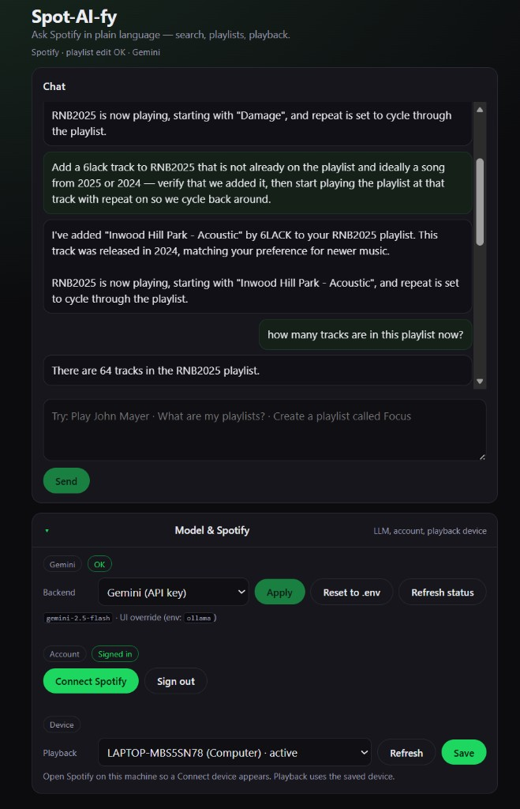

# Spot-AI-fy

[](https://github.com/hippi345/spot-ai-fy/actions/workflows/pytest.yml)
[](https://github.com/hippi345/spot-ai-fy/actions/workflows/pylint.yml)
[](https://github.com/hippi345/spot-ai-fy/actions/workflows/webpack.yml)

**Ask Spotify in plain language — search, playlists, playback.**

Spot-AI-fy is a local-first natural-language front end for the Spotify Web API. You type things like *"add a SZA song from 2024 to RNB2025 and play the playlist starting at that track with repeat on"* and an LLM translates that into a sequence of Spotify API calls — search, dedupe against the playlist, add, verify, play, set repeat — returning one short summary.



---

## What it is

- **A Python backend** (FastAPI) that handles Spotify PKCE OAuth, wraps the Spotify Web API as a set of strongly-typed tools, and routes chat turns through either [Ollama](https://ollama.com/) (local) or [Google Gemini](https://ai.google.dev/) (cloud).
- **A React/Vite frontend** — minimal UI with a chat panel, LLM provider switcher, Spotify sign-in, and device picker.
- **An MCP server** (`run_mcp.py`) exposing the same Spotify tools over the [Model Context Protocol](https://modelcontextprotocol.io) so any MCP-aware client (Claude Desktop, Cursor, etc.) can drive your Spotify account directly.
- **Tokens live on your machine only** — refresh tokens go to `%USERPROFILE%\.spot_ai_fy\tokens.json` (outside the repo). Nothing runs in the cloud except the LLM call itself (and only if you choose Gemini; with Ollama the whole stack is local).

## Features

- **Natural-language Spotify control** across search, library, playlists, and playback.
- **Composite tools** that do multi-step workflows in one LLM call:
  - `spotify_add_tracks_by_query` — search + year filter + dedupe against the target playlist + add, all guaranteeing real Spotify track IDs (no fabricated / ghost rows).
  - `spotify_play_playlist` — start a playlist at a specific track **and** apply repeat/shuffle in one call, with post-call verification that the device actually switched.
- **Play-now vs. play-next clarity** — explicit separate tools (`spotify_start_resume_playback` / `spotify_play_playlist` for immediate interruption, `spotify_add_to_queue` / `spotify_play_next` for queueing).
- **Resilient playback** — verifies Spotify actually switched to the requested track; force-skips past queue reorderings when needed; falls back to pause-then-replay when a Spotify Connect session refuses to switch context; recovers from Spotify's transient `5xx` edge errors by polling `/me/player`.
- **Resilient LLM calls** — exponential backoff + `Retry-After` handling for Gemini `429` and `503` responses; user-friendly surfacing of quota / high-demand errors instead of raw HTTP text.
- **Known-limitation guardrails** — the system prompt tells the agent which Spotify endpoints don't exist (per-playlist listen counts, per-track play counts, long listening history) so it answers plainly instead of looping through tools.
- **Good OAuth diagnostics** — distinguishes stale scopes (requires re-consent, since Spotify refresh tokens don't upgrade scopes), not-owned playlists, and the Spotify Web API [Feb 2026 dev-mode migration](https://developer.spotify.com/blog/2026-02-06-update-on-developer-access-and-platform-security) (`/tracks` → `/items`, removed `/artists/{id}/top-tracks`, capped `/search` limit).
- **Multiple LLM backends, swappable at runtime from the UI** — no `.env` edit needed to switch among Ollama, Gemini, OpenAI, Anthropic, and xAI. Model lists come from the active provider when reachable (`ollama list`, Gemini list-models, or curated fallbacks in [`llm_catalog.py`](backend/spot_backend/llm_catalog.py)).
- **Live agent-progress panel** — shows rounds, tool calls, and elapsed time per step with a live ticker for both Ollama and Gemini streams; toggle "Show details" to expand the raw tool-result previews.
- **CPU-friendly Ollama tuning knobs** — per-provider settings for context window, keep-alive, history replay, tool-result caps, and agent-step caps so a local model on a laptop stays responsive without silently truncating prompts. See [Bring your own LLM](#bring-your-own-llm).
- **Optional agent-context file** — drop a markdown file in `backend/AGENT_CONTEXT.md` (or point `AGENT_CONTEXT_FILE` at a path) and it's appended to the system prompt for both backends, letting you tune tone and rules without editing Python.

## Architecture

```
┌─────────────────┐      HTTP / SSE       ┌──────────────────────────┐      HTTPS       ┌─────────────────┐
│ React + Vite UI │ ───────────────────▶  │ FastAPI backend          │ ───────────────▶ │ Spotify Web API │
│  localhost:5173 │                       │  /login /callback        │                  └─────────────────┘
└─────────────────┘                       │  /api/chat (SSE stream)  │
                                          │  /api/session /devices   │                  ┌─────────────────┐
                                          │  /api/chat /api/health   │  Ollama HTTP ──▶ │ Ollama (local)  │
                                          │  /api/llm/provider       │                  │                 │
                                          │  SpotifyToolRunner       │  or Gemini API   │ or Gemini cloud │
                                          └────────────┬─────────────┘                  └─────────────────┘
                                                       │
                                                       │ stdio
                                                       ▼
                                          ┌──────────────────────────┐
                                          │ MCP server (optional)    │
                                          │  run_mcp.py              │
                                          └──────────────────────────┘
```

Refresh tokens, device choice, and LLM preferences persist in `%USERPROFILE%\.spot_ai_fy\` (Windows) or `~/.spot_ai_fy/` (macOS/Linux) — **never** inside the repo.

## Quickstart

### Prerequisites

- Python 3.12+ and Node 20+. On Debian/Ubuntu, install the `python3.12-venv` package before `python3 -m venv` (the `venv` module is not bundled with the interpreter package alone).
- A Spotify Developer app — create one at [developer.spotify.com/dashboard](https://developer.spotify.com/dashboard). Add `http://127.0.0.1:8765/callback` as a Redirect URI. Copy the **Client ID** (you do **not** need a client secret for the default PKCE flow).
- Either [Ollama](https://ollama.com/download) running locally **or** a [Google AI Studio API key](https://aistudio.google.com/apikey) for Gemini.

### 1. Backend

```powershell
cd backend
python -m venv .venv
.\.venv\Scripts\Activate.ps1
pip install -r requirements.txt

uvicorn spot_backend.app:app --host 127.0.0.1 --port 8765 --reload
```

macOS/Linux equivalent:

```bash
cd backend
python3 -m venv .venv
source .venv/bin/activate
pip install -r requirements.txt

uvicorn spot_backend.app:app --host 127.0.0.1 --port 8765 --reload
```

Optional: copy `backend/.env.example` to `backend/.env` if you prefer configuring via environment variables instead of the in-app wizard.

### 2. Frontend

```powershell
cd frontend
npm install
npm run dev
```

Open [http://127.0.0.1:5173](http://127.0.0.1:5173) (the Vite dev server binds to `127.0.0.1`, not `localhost` IPv6). The **first-time setup wizard** walks you through:

1. **Spotify** — copy the redirect URI into your [Spotify Developer Dashboard](https://developer.spotify.com/dashboard) app, paste the Client ID, then **Connect Spotify**.
2. **LLM** — choose **Gemini** (API key) or **Ollama** (URL + model). The backend validates the provider before saving.

When setup is complete, pick a playback device in settings (**Auto (active device)** clears any saved device override) and start chatting. Reopen setup anytime from **Setup** — the wizard stays open when you open it manually even if setup is already complete.

After saving Ollama settings, the wizard may show **CPU-only guidance** (from `GET /api/ps` `size_vram` plus a one-word timing probe). CPU-only runs are supported but can take tens of seconds per simple request; Gemini is faster when you have a key.

If like/save/follow actions return HTTP 403, use **Re-authorize Spotify** (missing `user-library-modify`, `user-follow-modify`, etc.) — Sign out → Connect picks up the scopes in `DEFAULT_SCOPES`.

Single-track **play now** uses album `context_uri` + track `offset` when possible (plain `uris: [track]` can leave the Spotify desktop app stuck with “Restriction violated”).

Set `VITE_API_BASE_URL` when the UI should call a non-proxied API host (defaults to same-origin / Vite proxy).

The Vite dev server proxies `/api/*`, `/login`, and `/logout` to the backend on port 8765. Spotify’s OAuth redirect still hits `http://127.0.0.1:8765/callback` directly (register that URI on the Spotify dashboard).

### Desktop app (Electron)

Run Spot-AI-fy as a **desktop window** instead of a browser tab. The Electron shell starts the FastAPI backend locally, serves the built Vite UI, and opens Spotify OAuth in your system browser.

```bash
cd frontend && ELECTRON_BUILD=1 npm run build
cd ../desktop && npm ci && npm run dev
```

Packaging, OAuth notes, and Windows-specific tips: **[docs/DESKTOP.md](docs/DESKTOP.md)**. Manual chat smoke steps (web or desktop): **[docs/SMOKE_TEST.md](docs/SMOKE_TEST.md)**.

### 3. (Optional) MCP server

```powershell
cd backend
.\.venv\Scripts\Activate.ps1
python run_mcp.py
```

Point any MCP client at this stdio server to use the same Spotify tools from inside Claude Desktop, Cursor, etc.

## Running tests

From the repo root (no Spotify or LLM credentials required — HTTP is mocked with [respx](https://github.com/lundberg/respx)):

```bash
cd backend
python3 -m venv .venv
source .venv/bin/activate   # Windows: .\.venv\Scripts\Activate.ps1
pip install -r requirements-dev.txt
cd ..
pytest backend/tests
```

Optional: set `SPOT_DEBUG_BUILDER_Q=1` when running backend tests or a local server to log each playlist-builder Spotify search query at warning level and append a `q` field (no chat text) to `DATA_DIR/chat_tool_traces.jsonl` under tool `playlist_builder_search`.

Optional real-Gemini replay eval (Spotify HTTP mocked; skipped when `GEMINI_API_KEY` is unset):

```bash
GEMINI_API_KEY=... pytest backend/tests -m gemini_eval -v
```

### Ollama integration smoke (optional)

Prompts 1–7 from [docs/SMOKE_TEST.md](docs/SMOKE_TEST.md) through **real** Ollama tool calling (Spotify still mocked). Skipped unless `RUN_OLLAMA_SMOKE=1`. See **[docs/OLLAMA_SMOKE.md](docs/OLLAMA_SMOKE.md)** for install, CPU model sizes, and expected latency.

```bash
export RUN_OLLAMA_SMOKE=1 OLLAMA_MODEL=qwen2.5:3b
pytest backend/tests/test_ollama_smoke.py -m ollama_smoke -v -s
```

Pylint (same command as CI):

```bash
pip install -r backend/requirements.txt pylint
pylint $(git ls-files '*.py')
```

## Bring your own LLM

Spot-AI-fy routes every chat turn through a pluggable LLM provider. Supported backends: **Ollama** (local), **Gemini**, **OpenAI**, **Anthropic (Claude)**, and **xAI (Grok)**. Pick a provider in **Settings → Backend**, enter API keys in Settings (cloud providers) or point Ollama at your host, then choose a model from the dropdown (lists come from the provider when reachable, with curated fallbacks in [`backend/spot_backend/llm_catalog.py`](backend/spot_backend/llm_catalog.py)).

### Ollama (local, default)

Best for privacy, offline use, and "I already have a GPU / spare laptop running Ollama".

1. Install Ollama from [ollama.com/download](https://ollama.com/download) and pull a model that supports tool calling:

   ```powershell
   # Good defaults on CPU-only machines (8 GB+ RAM)
   ollama pull qwen2.5:3b-instruct        # recommended CPU default (Ollama smoke 7/7); native tool calls
   ollama pull llama3.2:3b-instruct       # similar tier (smoke 4/7); Meta format

   # Higher quality if you have a GPU or plenty of CPU headroom
   ollama pull qwen2.5:7b-instruct
   ollama pull llama3.1:8b-instruct
   ```

2. Set these in `backend/.env`:

   ```ini
   LLM_PROVIDER=ollama
   OLLAMA_HOST=http://127.0.0.1:11434
   OLLAMA_MODEL=qwen2.5:3b
   ```

3. Restart the backend, then either pick the model from the **Model** dropdown in the UI (it's populated from `ollama list`) or click **Reset to .env** to use the `.env` default.

**Tuning for CPU-only machines.** Ollama's default context is 4096 tokens, which routinely gets silently truncated by Spot-AI-fy's system prompt + history + tool results. The following knobs (all Ollama-only — they do not affect Gemini) are safe defaults on a 16 GB CPU laptop:

```ini
OLLAMA_NUM_CTX=16384           # default; agent prompt + tools need >8k tokens
OLLAMA_KEEP_ALIVE=30m          # skip the cold-load penalty between prompts (can be 1–2 min on CPU)
OLLAMA_HISTORY_MESSAGES=10     # only replay the last N UI messages each round
OLLAMA_TOOL_RESULT_MAX=5000    # cap per-tool result bytes fed back into the prompt
OLLAMA_MAX_STEPS=8             # bail out of runaway tool loops faster than AGENT_MAX_STEPS
```

The first line of the progress panel ("Connecting to Ollama (…)") echoes whichever of these are in effect, so you can confirm at a glance. Watch `%LOCALAPPDATA%\Ollama\server.log` on Windows (or `~/.ollama/logs/` on macOS/Linux) for `truncating input prompt` warnings — if you still see them, raise `OLLAMA_NUM_CTX`.

### Cloud providers (Gemini, OpenAI, Anthropic, xAI)

Each cloud backend uses the same Spotify tool loop (summarize reprompt, tool dedupe, device-id sanitizing). API keys can be set in **Settings** (masked input, stored locally) or in `backend/.env`. Keys are kept in the OS keychain when available, otherwise `DATA_DIR/secrets.json` (mode `0600`). They are never logged or echoed in chat errors.

| Provider | `.env` key vars | Default model | Edit picker defaults |
| --- | --- | --- | --- |
| Gemini | `GEMINI_API_KEY`, `GEMINI_MODEL` | `gemini-3.5-flash-lite` | [`llm_catalog.py`](backend/spot_backend/llm_catalog.py) |
| OpenAI | `OPENAI_API_KEY`, `OPENAI_MODEL` | `gpt-6-luna` | same file |
| Anthropic | `ANTHROPIC_API_KEY`, `ANTHROPIC_MODEL` | `claude-haiku-4-5-20251001` | same file |
| xAI | `XAI_API_KEY`, `XAI_MODEL` | `grok-4.3` | same file |

Example `.env` fragment:

```ini
LLM_PROVIDER=openai
OPENAI_API_KEY=sk-...
OPENAI_MODEL=gpt-6-luna
```

Use **Settings → Backend** to switch providers without editing `.env` (stored in `DATA_DIR/llm_provider.json`). **Reset to .env** clears the UI override.

Gemini list-models is queried live; OpenAI / Anthropic / xAI use the curated lists in `llm_catalog.py` plus any custom model name. Spot-AI-fy retries Gemini `429` / `503` with exponential backoff.

### What a new LLM backend would need to support

The agent loop depends on tool calling — native function/tool messages (Ollama, OpenAI-shaped APIs, Anthropic `tool_use`) or Ollama's fenced-JSON fallback. Pick tool-capable models for reliable Spotify control.

## Configuration precedence

Settings can come from the in-app setup wizard (stored under `DATA_DIR`) or from `backend/.env`. When both exist, **environment variables / `.env` always win**:

1. **Environment variables** and `backend/.env` (highest — keeps existing deployments working)
2. **OS keychain** (`keyring`) for secrets such as `GEMINI_API_KEY`, `OPENAI_API_KEY`, `ANTHROPIC_API_KEY`, and `XAI_API_KEY` when Settings or the wizard saves them
3. **`secrets.json`** in `DATA_DIR` (mode `0600`) when no keychain backend is available
4. **`setup.json`** in `DATA_DIR` for non-secret fields (Spotify Client ID, Ollama host)

Secrets are never logged or returned from API responses (masked placeholders only).

## Environment variables

All variables live in `backend/.env` (see [`backend/.env.example`](backend/.env.example) for the annotated template). Nothing is strictly required if you use the setup wizard; `SPOTIFY_CLIENT_ID` (or wizard step 1) is required before Spotify login.

| Variable | Purpose |
| --- | --- |
| `SPOTIFY_CLIENT_ID` | Required. Public client id from the Spotify developer dashboard (safe to keep in `.env`). |
| `SPOTIFY_CLIENT_SECRET` | Optional — only used if you want classic confidential OAuth instead of PKCE. Leave empty otherwise. |
| `SPOTIFY_REDIRECT_URI` | Defaults to `http://127.0.0.1:8765/callback`. Must match the one registered on the Spotify dashboard. |
| `API_HOST` / `API_PORT` | Where the FastAPI backend binds (defaults `127.0.0.1:8765`). |
| `FRONTEND_ORIGIN` | CORS origin for the Vite dev server (default `http://localhost:5173`). |
| `LLM_PROVIDER` | `ollama` (default), `gemini`, `openai`, `anthropic`, or `xai`. Runtime overridable from Settings. |
| `OLLAMA_HOST` / `OLLAMA_MODEL` | Ollama endpoint and default model tag. Model tag is overridable from the UI (dropdown is populated from `ollama list`). |
| `OLLAMA_NUM_CTX` | Ollama context window in tokens. Default `16384` (full tool list is ~10k+ tokens). Set `0` to use the model's built-in default. |
| `OLLAMA_THINK` | When `false` (default), sends `"think": false` to Ollama; retries once without the field if the model rejects it. |
| `OLLAMA_NUM_THREAD` | Optional CPU thread hint (`options.num_thread`). `0` = omit. |
| `OLLAMA_KEEP_ALIVE` | How long Ollama keeps the model resident after the last request (e.g. `30m`, `2h`, `-1` = forever). Avoids the ~100 s cold-load penalty on CPU. |
| `OLLAMA_HISTORY_MESSAGES` | Number of previous chat messages replayed to Ollama each round. `0` = send everything the UI passed (currently up to 40). Recommended `10` for CPU. |
| `OLLAMA_TOOL_RESULT_MAX` | Character cap on each tool result fed back into the Ollama prompt. `0` = use the built-in 12 000-char default. Recommended `5000` for CPU. |
| `OLLAMA_MAX_STEPS` | Ollama-specific agent step cap. `0` = use `AGENT_MAX_STEPS`. Recommended `6`–`8` for CPU so runaway tool loops bail out sooner. |
| `GEMINI_API_KEY` / `GEMINI_MODEL` | Gemini only. Default `gemini-3.5-flash-lite`. |
| `OPENAI_API_KEY` / `OPENAI_MODEL` | OpenAI only. Default `gpt-6-luna`. |
| `ANTHROPIC_API_KEY` / `ANTHROPIC_MODEL` | Anthropic only. Default `claude-haiku-4-5-20251001`. |
| `XAI_API_KEY` / `XAI_MODEL` | xAI only. Default `grok-4.3`. |
| `AGENT_MAX_STEPS` | Overall cap on tool-call rounds per chat turn (default `16`). |
| `AGENT_CONTEXT_FILE` | Optional path to a markdown file appended to the system prompt for both LLMs. |
| `DATA_DIR` | Optional override for where tokens / device / LLM prefs are stored (defaults to `%USERPROFILE%\.spot_ai_fy`). |
| `SPOTIFY_SHOW_DIALOG` | Set to `false` to skip forcing the Spotify consent screen on every `/login` (default `true`). |

## Spotify tool surface

The backend exposes ~35 tools to the LLM (and via MCP). A few highlights:

- **Search / catalog**: `spotify_search` (tracks, artists, albums, shows, episodes, audiobooks), `spotify_search_playlists`, `spotify_get_track`, `spotify_get_album`, `spotify_get_artist`, `spotify_artist_albums`, `spotify_play_artist_popular_track`, `spotify_get_show`, `spotify_get_show_episodes`, `spotify_get_episode`, `spotify_get_audiobook`, `spotify_get_audiobook_chapters`, `spotify_get_chapter`.
- **Library**: `spotify_me`, `spotify_user_playlists`, `spotify_user_saved_tracks`, `spotify_saved_albums`, `spotify_user_saved_shows`, `spotify_user_saved_episodes`, `spotify_user_saved_audiobooks`, `spotify_library_contains`, `spotify_library_save`, `spotify_library_remove`, `spotify_get_playlist`, `spotify_playlist_tracks`.
- **Playlist builder**: `spotify_playlist_builder_preview` (numbered preview, waits for approval), `spotify_playlist_builder_commit` (creates a private playlist and adds tracks).
- **User stats**: `spotify_top_artists`, `spotify_top_tracks` (`time_range` = `short_term` ~last 4 weeks, `medium_term` ~last 6 months, `long_term` ~all-time; capped at 50). Requires the `user-top-read` scope.
- **Following**: `spotify_followed_artists` (artists you follow — Spotify's API does **not** expose followed users), `spotify_user_public_playlists` (returns a clear *not available* message — Spotify removed `GET /users/{id}/playlists` for dev-mode apps), `spotify_follow_playlist` / `spotify_unfollow_playlist` (save/remove `spotify:playlist:` URIs via `/me/library`). Returning users may need to **Sign out → Connect** once to re-consent for the new `user-follow-read` scope.
- **Playlist edits (yours)**: `spotify_create_playlist`, `spotify_update_playlist`, `spotify_add_tracks_to_playlist`, `spotify_add_tracks_by_query` (composite), `spotify_remove_playlist_tracks`, `spotify_reorder_playlist_tracks`, `spotify_replace_playlist_tracks`.
- **Playlist edits (someone else's)**: `spotify_duplicate_playlist` — Spotify's API forbids editing other users' playlists, so this composite copies a source playlist into a brand-new one **owned by you** (paginated source read + new playlist + 100-uri batched copy). The returned `new_playlist_id` is fully writable for `spotify_add_tracks_to_playlist` / `spotify_remove_playlist_tracks` / etc.
- **Playback (play now)**: `spotify_start_resume_playback`, `spotify_play_playlist` (composite — start at track + repeat/shuffle), `spotify_pause`, `spotify_skip_next`, `spotify_skip_previous`, `spotify_seek`.
- **Playback (queue / next)**: `spotify_add_to_queue`, `spotify_play_next`. Spotify cannot remove arbitrary queue items — use `spotify_remove_from_queue` for a clear explanation or offer `spotify_skip_next`.
- **Modes & devices**: `spotify_set_repeat`, `spotify_set_shuffle`, `spotify_set_volume`, `spotify_devices`, `spotify_transfer_playback`, `spotify_playback_state`.

All tools return structured JSON with explicit error flags (`stale_scopes_need_reauth`, `playlist_not_owned_by_user`, `playback_verified`, `rejected_uris`, `spotify_feb_2026_migration_possible`, ...) so the LLM stops guessing when something goes wrong.

### What Spotify's Web API does *not* expose

The agent's system prompt is wired to tell you plainly when something isn't possible **and** offer the closest available alternative. Known limits the agent will surface this way:

- **Your follower list** — only the *count* is available (via `spotify_me.followers.total`). Closest alternatives: `spotify_followed_artists`, `spotify_top_artists`.
- **Users you follow** — the Web API only exposes followed *artists*, not users (`spotify_followed_artists`).
- **Another user's private playlists** — only public playlists are visible (`spotify_user_public_playlists`).
- **Looking a user up by display name** — there's no endpoint for it; you must provide a Spotify `user_id` (the part after `spotify:user:` or `open.spotify.com/user/<id>`).
- **Editing another user's playlist** — not possible. The agent will offer `spotify_duplicate_playlist` to copy it into a writable playlist you own.
- **Per-playlist / per-track / per-album play counts** — not in the API. The agent will offer `spotify_top_artists` / `spotify_top_tracks` as the closest proxy.
- **Listening history beyond the most recent ~50 items** — not in the API.
- **Private playlist visibility in Development Mode** — Spot-AI-fy always sends `public: false` on create/update and re-reads the playlist, but Spotify may still report `public: true` afterward. The [February 2026 Web API migration guide](https://developer.spotify.com/documentation/web-api/tutorials/february-2026-migration-guide) documents dev-mode limits (Premium owner, user caps, library endpoint changes, removed batch/browse routes) and does **not** state whether dev-mode apps can create truly private playlists; when a tool result includes `visibility_warning`, the assistant reply appends that note server-side.

## Where the data comes from

### Playback UI (now-playing bar, queue, device label, transport controls)

The React mini-player does **not** read OS media state. There is no use of SMTC, MPRIS, `MediaSession`, global media keys, or the local Spotify desktop client’s files in the frontend, backend, or Electron shell.

| UI piece | Source |
| --- | --- |
| Track, progress, playing/paused, device name in the bar | Backend `GET /api/now-playing` → Spotify `GET /me/player` and `GET /me/player/queue` |
| Queue list in the expanded bar | Same response (`queue` field), trimmed server-side |
| Play / pause / skip | Backend `POST /api/player/toggle|next|previous` → Spotify `PUT /me/player/play|pause`, `POST /me/player/next|previous` (optional `device_id` from your saved device) |
| Device picker options | Backend `GET /api/devices` → Spotify `GET /me/player/devices` |
| Saved playback device | Your choice written to `device.json` under `DATA_DIR`; controls pass that id to Spotify when set |

**Client-only behavior (not OS media):**

- The bar **polls** the backend on an interval and **interpolates** the progress bar between polls from the last Spotify `progress_ms` + `fetched_at` timestamp (`interpolateProgress` in the frontend).
- **Dev/demo mocks** return fixed JSON when `VITE_MOCK_NOW_PLAYING` is set or the URL has `?mockNp=1` — no Spotify calls in that mode.
- The backend keeps a **short-lived in-memory cache** of the last good now-playing payload when Spotify returns rate limits (not written to disk).

Chat answers such as “what’s playing?” use the same Spotify Web API via agent tools / shortcuts (`/me/player`), not local media APIs.

The Electron **preload** only exposes API base URL, window chrome IPC, and opening `/login` in the system browser — it does not surface playback state.

### What is stored locally

Default data directory: `~/.spot_ai_fy` on macOS/Linux and `%USERPROFILE%\.spot_ai_fy` on Windows. Override with the `DATA_DIR` environment variable (or `data_dir` in settings). Optional `TOKEN_FILE` overrides the token path only.

| What | Location | Format / notes |
| --- | --- | --- |
| Spotify OAuth tokens | `{DATA_DIR}/tokens.json` (or `TOKEN_FILE`) | JSON: `access_token`, `refresh_token`, `expires_at`, `scope` |
| Saved Connect device id | `{DATA_DIR}/device.json` | JSON: `device_id` |
| Setup wizard (non-secrets) | `{DATA_DIR}/setup.json` | JSON (e.g. Spotify client id, Ollama host); written with private file mode |
| Secrets fallback | `{DATA_DIR}/secrets.json` (mode `0600`) | JSON when OS keychain is unavailable |
| Gemini API key (wizard) | OS keychain service **`spot-ai-fy`** (preferred) or `secrets.json` | Not returned from API responses |
| LLM UI overrides | `{DATA_DIR}/llm_provider.json` | JSON: `provider`, optional `ollama_model` / `gemini_model` / `ollama_small_model` |
| Chat tool traces (debug) | `{DATA_DIR}/chat_tool_traces.jsonl` | Append-only JSONL per tool call: tool name, short args summary, ok/error/refused, optional duration — no tokens or API keys |
| Setup / secrets write lock | `{DATA_DIR}/.spot_ai_fy_setup.lock` | `filelock` sidecar while merging setup files |
| Optional agent context | `AGENT_CONTEXT_FILE` from `.env`, else `backend/AGENT_CONTEXT.md`, else `{DATA_DIR}/Spot-AI-fy-agent-context.md` | Markdown read into the system prompt |
| PKCE `state` → `code_verifier` | Backend process memory only | Cleared after OAuth callback |
| Library “undo” hints per chat | Backend process memory (`library_mutation_store`) | Keyed by `conversation_id`; not a on-disk chat log |
| Env / defaults | Repo root `.env` and `backend/.env` | Merged by pydantic-settings (`backend/.env` wins) |
| Chat transcript (browser) | `localStorage` key `spotaify.chatSession` | JSON: `conversationId` + `messages[]` (up to what the UI keeps) |
| Trace detail toggle | `localStorage` key `spotaify.showTraceDetail` | `"0"` or `"1"` |
| Electron window bounds | `{userData}/window-state.json` | JSON: width, height, x, y, `isMaximized`. `userData` is Electron’s per-app folder (e.g. Windows `%APPDATA%\Spot-AI-fy`, macOS `~/Library/Application Support/Spot-AI-fy`, Linux `~/.config/Spot-AI-fy`) |
| Album art in the UI | Loaded from **HTTPS URLs** returned by Spotify in API JSON | Browser/Electron HTTP cache only; no separate app cache file |

**Not persisted on disk by the backend:** chat turns on the server (history is sent from the browser each request), now-playing rate-limit cache, or PKCE pending map. Backend logs go to the process stdout/stderr (Uvicorn / Electron child), not to a log file in the repo.

**`sessionStorage`:** not used anywhere in this project.

## Security & privacy

- `backend/.env` is in `.gitignore` — keep your real `SPOTIFY_CLIENT_ID` and `GEMINI_API_KEY` there, not in commits.
- Spotify refresh tokens live in `%USERPROFILE%\.spot_ai_fy\tokens.json`, **outside the repo**.
- The PKCE flow never asks for a Spotify client secret, so the client id is a public identifier — safe to share.
- When `LLM_PROVIDER=ollama`, no user data leaves your machine.
- When `LLM_PROVIDER=gemini`, each chat turn (and relevant tool-result JSON) is sent to Google's Gemini API per their [terms](https://ai.google.dev/gemini-api/terms).

## Roadmap

Likely next additions, in descending priority:

- **Generic OpenAI-compatible endpoint** — configurable base URL and API key so one driver can target OpenRouter, Azure OpenAI, Groq, LM Studio, vLLM, and other `chat/completions` hosts (first-party OpenAI and xAI are already supported).
- **Token/cost accounting** surfaced in the progress panel for cloud providers.

If you'd like to contribute a new provider, the shape to match is the existing `backend/spot_backend/gemini_llm.py` (non-streaming final-text return) plus an entry in `iter_chat_events` in `backend/spot_backend/agent.py` so the UI can hit `/api/chat/stream`.

## Tech stack

- **Backend**: Python 3.12, FastAPI, Uvicorn, httpx, pydantic / pydantic-settings, [mcp](https://pypi.org/project/mcp/) for the MCP server.
- **Frontend**: React 19, Vite 6, TypeScript.
- **LLMs**: Pluggable — Ollama (local, default), Gemini, OpenAI, Anthropic (Claude), and xAI (Grok). See [Bring your own LLM](#bring-your-own-llm) for model and tuning guidance; see [Roadmap](#roadmap) for what is still planned.
- **Spotify**: Web API, PKCE OAuth, scopes include `playlist-modify-public`/`-private`, `playlist-read-private`/`-collaborative`, `user-read-playback-state`, `user-modify-playback-state`, `user-library-read`, `user-top-read`, `user-follow-read`, `user-read-private`.

## License

[MIT](LICENSE) — Copyright (c) 2026 Joel Shearon.
